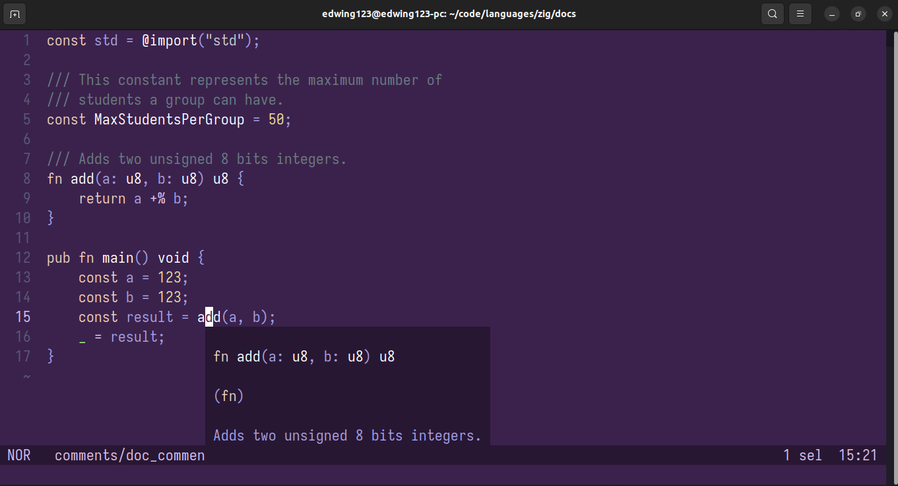

# Comments in Zig

as with many languages, zig offers a way to add comments
to our code.

comments in Zig start with two forward slashes (`//`) and end until
the end of the line.

```zig
// This is a comment.
const std = @import("std");

// This is another comments.
// The below constant definition is commented.
// const year = 2023;
```

In Zig there are not multiline comments, for example: `/**/` in C or Javascript.
Some people are okay with this, and I've been getting used to it, too. However,
I would like to have multiline comments.

## Doc comments

Or documentation comments.

Zig offers a special kind of comment, this type of comment is used
to add documentation to whatever follows that comment, for example, a function
definition, constant, etc.

A doc comment starts with _exactly_ three forward slashes (`///`):

```zig
/// This is a doc comment.
const what = "Nothing".
```

Multiple doc comments in a row are "merged" to form a multiline comment:

```zig
/// This constant represents the maximum number of students
/// a group can have.
const MaxStudentsPerGroup = 40;
```

This "merging" means that all those doc comments will be shown as documentation.

Okay, that sounds cool, but what do you mean when you say "shown as documentation"?
Where will the documentation be shown?

Well, in editors like VSCode and Helix with the ZLS installed, whenever you hover
over a variable, a function, a type, etc. The editor will show information about it
in a pop-up, and if doc comments were written for it, it'll also show them, here is
an example:



> Note: ZLS is an implementation of Microsoft language server protocol for Zig.
> In short, it's a program that editors like VSCode and Helix use to offer functionalities
> like autocomplete, go to references, code static analysis, etc.

As a note, the documentation says that doc comments are only
allowed in some places, and that in the future, the compiler
will show an error if it finds a doc comment in a wrong place.

