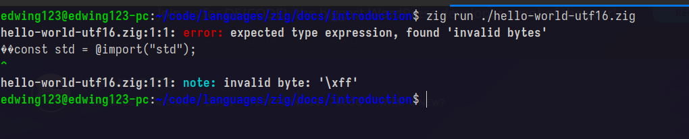

# Introduction

In the documentation we are welcomed by the following text, which seems to me
a brief description of what Zig is:

> Zig is a general-purpose programming language and toolchain for
> maintaining robust, optimal, and reusable software.

Let's extract and try to understand the key elements from this description:

- General-purpose programming language.
- Toolchain.
- Robust.
- Optimal.
- reusable.

## General-purpose programming language?

Zig is said be a general-purpose programming language, so the next question arises:
what's a general-purpose programming language? and if there's such _category_ of
programming languages, does that mean there's specific-purpose programming languages?

I have read about this before, in fact, all the programming languages I've learned
fall into the category of general-purpose: JavaScript, Python, Go, Ruby and Zig. So,
in my understanding, a general-purpose programming language is one that is not created
to resolve a specific problem, or a specific set of problems within a particular _domain_,
but rather a wider range of problems within several domains.

In the context of software development, we can see how many of the problems we develop
solutions for, fall into a particular category, for example:

- Statistical.
- Financial.
- E-commerce.
- Medicine.
- Robotics.
- Physics.
- Mathematics.
- Networking.

We call a "domain" to each of these categories, and a general-purpose programming language is
not designed to be used in a specific domain, but rather in all of them. Most of the time, this
means that the language provides all that is needed to develop solutions for problems within
these domains.

On the other hand, there's programming languages that are designed for developing solutions
for specific domains, and these languages are called _domain specific languages_.

[Here](https://developer.mozilla.org/en-US/docs/Glossary/DSL/Domain_specific_language)
is brief definition on DSLs (Domain Specic Languages).

In conclusion, Zig is a programming language that addresses many problems across
many domains.

## Toolchain

A toolchain refers to a set of tools that assist the development of software,
in the case of Zig, Zig provides tools such as: a code formatter, a compiler
for Zig source code, a build system, C and C++ compilers, a test runner, and more.

You can check the tools it provides by running the command `zig --help`.

## Robust

As per the docs:

> behavior is correct even for edge cases such as out of memory.

I kind of don't like the wording of this sentence, specifically the part "behavior is correct",
and that's because I don't necessarily see the relatioship between behavior and robustness, however,
I think I get the gist of it, in which programs created with Zig can endure situations such as
"no having more memory available to work it".

If I were to reword that sentence, I'd write something like this:

> Programs created in Zig can continue to work even for edge cases
> such as out of memory.

## Optimal

As per the docs:

> Write programs the best way they can behave and perform.

I think that with this, they are referring to the fact Zig gives
a lot of control of the code to programmers, for example, managing
the memory manually, and in this way one can create programs that are
very performant.

> Note: I'm really not sure about this point, so I'll work on it later.

## reusable

As per the docs:

> The same code works in many environments which have different constraints.

This pretty much means that Zig programs can be compiled for a wide variety of
CPUs, operating systems, and even for platforms such as WebAssembly.

## The Zig standar libraries

As with many programming languages, Zig provides a _standard library_, which offers
things like:

- Common data structures (queue, stack, etc).
- Common algorithms.
- APIs for consuming OS services/functionalities.

And a lot of more things which ease the development.

The documentation for the standard library is at a different page,
[here](https://ziglang.org/documentation/master/std/) is the link.

## The hello world program

The first program in the documentation is **the Hello World** program.
This is a popular program that is created the first time you learn (or teach)
a programming language.

The goal of the program is to display the text "Hello World" in the console/terminal
of the computer. It's fairly simple.

You can take a look at the program [here](./hello-world.zig).

The program is stored in a file named `hello-world.zig`. According to the docs,
files storing Zig source code are UTF-8 encoded, this pretty means that the algorithm
used for encoding the _characters_ is UTF-8, which is a variable-width encoding algorithm
that follows the Unicode standard.

> For information about Unicode and UTF-8, check out [this](https://blog.hubspot.com/website/what-is-utf-8)
> and [this](https://deliciousbrains.com/how-unicode-works/).

> There are more resources and information on the web, however, I shared
> these because I actually read them.

More about the encoding that Zig expects

Zig expects the files containing Zig source code to encoded with UTF-8.

For example, the file [here](./hello-world-utf16.zig) is encoded with UTF-16,
try executing that program with `zig run ./hello-world-utf16.zig`. In my case,
I am getting the following error:

